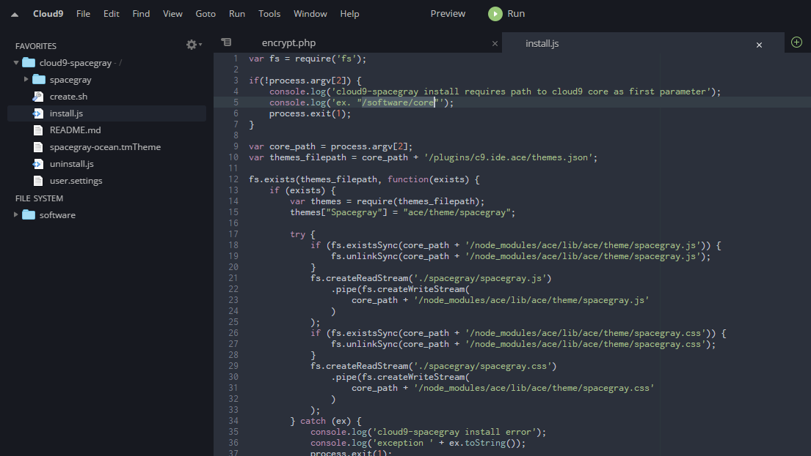

# cloud9-spacegray

A Spacegray editor and IDE theme for an installed Cloud9 instance.

Spacegray Sublime Text theme from [spacegray-ocean.tmTheme](https://github.com/kkga/spacegray)

The IDE theme modifies the `flat-light` built into Cloud9.

***



#### Installing

1. Start with either `Building` or using the prebuilt spacegray folder and
user.settings
2. CD to cloud9-spacegray directory
3. run ```node install.js /path/to/cloud9/root(core)```
3. Replace your Cloud9 user.settings with the one in this repo or merge your
personal one with it.

#### Uinstalling

1. CD to cloud9-spacegray directory
2. run ```node uninstall.js /path/to/cloud9/root(core)```
3. Replace your editor theme in the Cloud9 Preferences

#### Building

1. Update or use the existing `spacegray-ocean.tmTheme` Sublime Text theme.Building
2. CD to cloud9-spacegray directory
3. run ```./create.sh  /path/to/cloud9/root(core)```
4. Resulting files for editor will be in ./spacegray